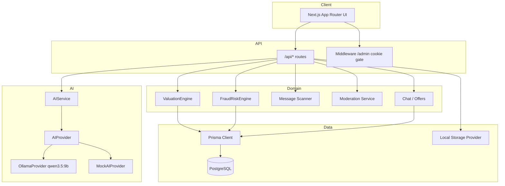

# FairPrice AI

**Know What It's Worth.**

India's AI-powered marketplace for smarter, safer reselling. Get fair valuations in INR, detect fraud signals in chat, and negotiate with confidence.

## Overview

FairPrice AI helps buyers and sellers price used goods using a **deterministic valuation engine**, local **market comparables**, and optional **Ollama** (Qwen) explanations — with trust & safety tooling for OTP/QR/UPI scam patterns.

## Architecture



## Features

- Marketplace browse / search across **22+ categories** with **city + near-me** discovery
- SEO city hubs (`/in/[city]/[category]`) for India metros
- Phone OTP sign-in (primary) + Google + email; face verification for Trusted Seller / high-risk only
- AI-assisted **fair value** ranges with price verdicts (underpriced → overpriced)
- Quick sell + full mobile condition wizard
- In-app chat with safety scanning, canned replies, meetup suggestions, phone reveal, mark sold
- Offers, favorites, notifications, reviews, saved search alerts
- Listing boosts / featured (mock payments), dealer storefronts, FairPrice Assist escrow UI
- Fraud risk scoring, FairPrice ID verification, admin console
- PWA install + Hindi/EN language toggle
- Business / developer valuation API surface
- Local AI via **Gemini / Ollama** with automatic **mock** fallback

## Requirements

- **Node.js 20+**
- **Docker** (PostgreSQL via `docker-compose.yml`)
- **Ollama** (optional) with model `qwen3.5:9b`
- npm (or compatible package manager)

## Installation

```bash
git clone <repo-url> fairprice-ai
cd fairprice-ai
npm install
cp .env.example .env
docker compose up -d
```

## Environment variables

See `.env.example`. Key variables:

| Variable | Purpose |
|----------|---------|
| `DATABASE_URL` | PostgreSQL connection string |
| `AUTH_SECRET` | JWT/session signing secret (32+ chars) |
| `APP_URL` | Public app URL |
| `AI_PROVIDER` | `auto` \| `ollama` \| `mock` |
| `OLLAMA_BASE_URL` | Default `http://localhost:11434` |
| `OLLAMA_MODEL` | Default `qwen3.5:9b` |
| `STORAGE_PROVIDER` | `local` \| … |
| `DEMO_MODE` | Enables demo-friendly defaults |
| `ADMIN_EMAIL` / `ADMIN_PASSWORD` | Seed admin credentials |

## Ollama setup (`qwen3.5:9b`)

```bash
# Install Ollama from https://ollama.com
ollama pull qwen3.5:9b
ollama serve
```

Set in `.env`:

```env
AI_PROVIDER=auto
OLLAMA_BASE_URL=http://localhost:11434
OLLAMA_MODEL=qwen3.5:9b
```

If Ollama is down, FairPrice AI falls back to `MockAIProvider` so demos still work.

## Database setup, migrate, seed

```bash
npm run db:generate
npm run db:migrate
# or for quick local: npm run db:push
npm run db:seed
```

Seed creates categories, ~100 Indian demo users, products/variants, 200+ listings, valuations, chats (including safety-trigger demos), offers, FAQs, and blog posts.

## Demo accounts

| Email | Password | Role |
|-------|----------|------|
| `admin@fairprice.ai` | `FairPriceAdmin123!` | `SUPER_ADMIN` |
| `buyer@demo.fairprice.ai` | `demo1234` | `BUYER` |
| `seller@demo.fairprice.ai` | `demo1234` | `SELLER` |

Generic seeded users: `user001@demo.fairprice.ai` … (password `FairPriceDemo1!`).

## Run, test, build

```bash
npm run dev          # http://localhost:3000
npm run build
npm start

npm test             # Vitest unit tests
npm run test:watch
npm run test:e2e     # Playwright (skips if server is down)
npm run typecheck
npm run lint
```

Start the app before e2e, or set `PLAYWRIGHT_BASE_URL`.

## AI architecture

`AIService` → `createAIProvider()` → **OllamaProvider** or **MockAIProvider**.

- Prompt modules live under `src/lib/ai/prompts/`
- Structured outputs validated with Zod schemas in `src/lib/ai/schemas.ts`
- Use cases: valuation explanation, condition, fraud narrative, negotiation, search filters, listing copy, support

## Valuation architecture

1. **Comparables** — market snapshots + synthetic/real comps
2. **ValuationEngine** (`src/services/valuation/engine.ts`) — deterministic mid/min/max, condition/age/location/demand/liquidity factors, confidence
3. **Price verdict** — `computePriceVerdict(asking, fairMid, fairMin, fairMax)`
4. **Explanation** — optional LLM narrative via `ValuationExplanationService` (never replaces the engine numbers)

## Fraud architecture

- **FraudRiskEngine** — weighted signals → score → `LOW` / `MEDIUM` / `HIGH` / `CRITICAL`
- **Message scanner** — OTP, UPI PIN, QR, WhatsApp/Telegram, gift cards, courier scams, phishing links
- Moderation service combines listing + chat signals for review queues

## Provider abstractions

| Domain | Location | Notes |
|--------|----------|-------|
| AI | `src/providers/ai` | Ollama / Mock |
| Storage | `src/providers/storage` | Local uploads |
| Email / SMS / Payments / Maps | `src/providers/*` | Mock-ready for production swap |

## Security

- Session cookie `fp_session` (HTTP-only JWT + DB session)
- Password hashing via **bcryptjs**
- RBAC permissions in `src/lib/auth/rbac.ts`
- `/admin` middleware redirects if cookie missing (full auth in pages)
- Security headers from `src/lib/security/headers.ts` applied in `next.config.ts`
- Chat safety warnings for high-risk phrases
- `.env` and `/storage` gitignored

## Roadmap

- Production payment + escrow partners
- Stronger identity verification (Aadhaar/KYC partner)
- Real-time market ingest (non-synthetic comps)
- Redis-backed rate limiting
- Mobile apps / PWA push
- Expanded B2B valuation SLA tiers

## FairPrice AI branding

- **Name:** FairPrice AI  
- **Tagline:** Know What It's Worth.  
- **Promise:** Transparent INR valuations, safer chats, clearer deals for India's second-hand market.

---

© FairPrice AI — demo / development project.
