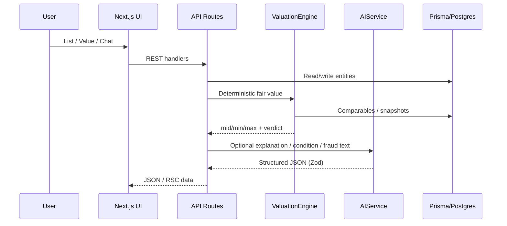

# FairPrice AI — Architecture

**Know What It's Worth.** This document summarizes the current application architecture.

## Stack

- **Next.js 15** (App Router) + React 19 + TypeScript
- **PostgreSQL** via **Prisma**
- **Vitest** (unit) + **Playwright** (e2e smoke)
- **Ollama** optional LLM (`qwen3.5:9b`) with mock fallback
- **bcryptjs** + **jose** for auth

## High-level flow



## Folder structure

```
Trail@1/
├── prisma/
│   ├── schema.prisma      # Full domain model
│   └── seed.ts            # Comprehensive India demo seed
├── public/
│   └── placeholders/      # Demo product images
├── src/
│   ├── app/               # Routes (marketing, marketplace, dashboards, admin, api)
│   ├── components/        # UI: layout, marketplace, valuation, admin, chat, …
│   ├── config/            # site.ts, env
│   ├── lib/
│   │   ├── auth/          # session, password, rbac, middleware helpers
│   │   ├── ai/            # AIService, prompts, schemas
│   │   ├── api/           # handler helpers, errors
│   │   ├── db/            # Prisma client
│   │   └── security/      # headers, rate-limit helpers
│   ├── providers/         # AI, storage, email, sms, payments, maps
│   ├── services/
│   │   ├── valuation/     # engine, model, comps, explanation
│   │   ├── fraud/         # risk engine + message scanner
│   │   ├── chat/          # conversations / safety
│   │   └── moderation/
│   └── middleware.ts      # /admin cookie presence gate
├── tests/
│   ├── unit/              # Vitest
│   └── e2e/               # Playwright smoke
├── docs/
│   └── ARCHITECTURE.md    # this file
├── docker-compose.yml
├── next.config.ts
├── vitest.config.ts
└── playwright.config.ts
```

## Domain model (DB)

Core aggregates:

- **User / Profile / Session** — roles from `USER` → `SUPER_ADMIN`, trust scores, verification levels
- **Category / CategoryAttribute / Product / ProductVariant** — catalog + dynamic attribute schemas
- **Listing** (+ images, attributes, condition, promotions)
- **Valuation / ValuationFactor / MarketPriceSnapshot / ComparableListing / DemandSnapshot**
- **Conversation / Message / Offer**
- **Transaction / Review / Favorite / Notification**
- **FraudRisk / FraudSignal / Report / ModerationCase**
- **BlogPost / FAQ / BusinessAccount / APIKey**

## Security

| Layer | Mechanism |
|-------|-----------|
| Transport / browser | CSP, HSTS, X-Frame-Options, nosniff via `getSecurityHeadersConfig()` |
| Auth | `fp_session` cookie; password bcrypt (12 rounds) |
| Authorization | `hasPermission` / `requireRole` RBAC |
| Admin edge | `src/middleware.ts` redirects unauthenticated `/admin` traffic |
| Chat | Message scanner flags OTP / UPI PIN / QR / off-platform |
| Uploads | Local storage under `/storage` (gitignored); body size limit in Next config |
| Secrets | `.env*` ignored; only `.env.example` committed |

Full admin authorization is enforced in server components / API routes after the cookie gate.

## AI layer

```
AIService
  └─ createAIProvider()
        ├─ OllamaProvider  (preferred when available)
        └─ MockAIProvider  (demo / offline)
```

- `AI_PROVIDER=auto` tries Ollama, then mock
- Prompts are versioned strings; responses parsed as JSON and validated with Zod
- Valuation **numbers** come from the deterministic engine; AI supplies narrative/explanation only

## Valuation layer

1. Normalize attributes (condition score, age, demand, liquidity)
2. Load comparables (DB or injected for tests)
3. Remove outliers → median / p25 / p75
4. Apply multipliers: condition, residual age, location, demand, liquidity
5. Emit fair band, recommended list price, quick-sale, negotiation range, confidence
6. `computePriceVerdict` classifies asking price vs fair mid

Confidence drops when samples are sparse or **all comps are synthetic** (`isSynthetic: true`).

## Fraud layer

- **FraudRiskEngine.assess(context)** sums weighted signals (price-too-good, new account, external payment, duplicate images, message flags, …)
- Levels: `LOW` (<35), `MEDIUM` (35–59), `HIGH` (60–79), `CRITICAL` (≥80)
- **scanMessage** returns `riskScore`, `flags`, `warning`, `matchedPatterns` for chat UI banners

## Provider abstractions

Swap implementations without rewriting routes:

- AI, storage, email, SMS, payments, maps under `src/providers/*`
- Env flags select `local` / `mock` / future production adapters

## Testing

- Unit: valuation engine, price verdict, fraud engine, message scanner, RBAC, password
- E2E smoke: home + marketplace (auto-skip if no server)

## Seed data

`npm run db:seed` wipes relational demo data in FK-safe order and recreates a rich India-centric dataset (cities, INR MSRPs, safety-trigger chats). Bios/descriptions are marked as demo where appropriate.

## Related docs

- Root [README.md](../README.md) — install, env, Ollama, demo accounts, roadmap
